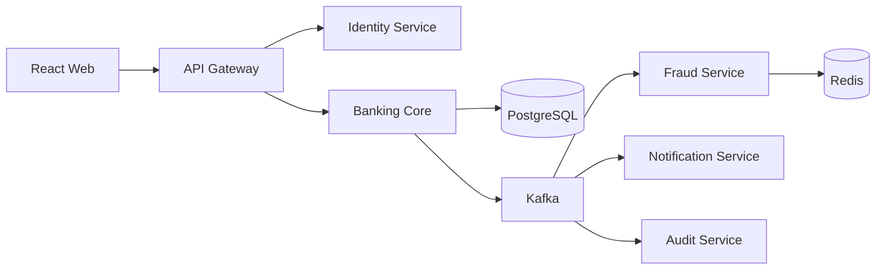

# SecureBank — Claude Code Master Build Specification

> **Purpose:** This file is a complete implementation brief for Claude Code running inside VSCode.  
> **Goal:** Build a production-style portfolio project for a candidate applying to an IT/backend role in a bank.  
> **Primary focus:** Java/Spring Boot backend engineering, secure transaction processing, PostgreSQL, JPA, Spring Security, Kafka, Redis, Docker, testing, observability, and a usable React web UI.

---

# 1. Mission

Build a complete project named:

**SecureBank — Digital Banking Transaction & Fraud Monitoring Platform**

The project must simulate realistic banking transaction workflows and demonstrate strong backend engineering rather than being a simple CRUD project.

The final system must support:

- Customer authentication
- Role-based authorization
- Customer profile
- Bank accounts
- Account balances
- Internal account-to-account transfers
- Transaction history
- Double-entry ledger
- ACID transaction handling
- Concurrency protection
- Idempotent transfer requests
- Transfer limits
- Rule-based fraud detection
- Fraud alerts for bank staff
- Account freezing/unfreezing
- Audit logs
- Kafka event-driven processing
- Transactional Outbox Pattern
- Redis usage
- Docker Compose
- REST APIs
- OpenAPI/Swagger
- Automated tests
- React + TypeScript frontend
- Customer banking portal
- Bank operations/admin portal
- Monitoring endpoints
- Clean README and setup instructions

This project should be credible as a portfolio project for a banking IT/backend engineering application.

---

# 2. Technology Stack

Use the following technologies unless there is a strong technical reason not to.

## Backend

- Java 21
- Spring Boot 3.x
- Maven
- Spring Web
- Spring Data JPA
- Hibernate
- Spring Security
- Spring Validation
- Spring Kafka
- Spring Data Redis
- Spring Boot Actuator
- PostgreSQL Driver
- Flyway
- JWT authentication
- Lombok where it improves readability
- MapStruct optional
- Jackson

## Testing

- JUnit 5
- Mockito
- Spring Boot Test
- Testcontainers
- PostgreSQL Testcontainer
- Kafka Testcontainer if practical
- Redis Testcontainer if practical

## Frontend

- React
- TypeScript
- Vite
- Tailwind CSS
- React Router
- Axios
- TanStack Query preferred
- Recharts optional for dashboard charts

## Infrastructure

- Docker
- Docker Compose
- PostgreSQL
- Redis
- Kafka in KRaft mode if possible
- Prometheus optional but preferred
- Grafana optional but preferred

## API Documentation

- Springdoc OpenAPI
- Swagger UI

---

# 3. Important Architecture Decision

Do **not** split money movement across multiple services in a way that requires a distributed database transaction.

Use the following architecture:

```text
                               ┌───────────────────────┐
                               │      React Web       │
                               │ Customer + Bank Ops  │
                               └───────────┬───────────┘
                                           │
                                           ▼
                                  ┌────────────────┐
                                  │  API Gateway   │
                                  └───────┬────────┘
                                          │
                  ┌───────────────────────┼─────────────────────────┐
                  │                       │                         │
                  ▼                       ▼                         ▼
          ┌───────────────┐      ┌───────────────────┐     ┌──────────────────┐
          │ Identity      │      │ Banking Core      │     │ Fraud Service    │
          │ Service       │      │ Service           │     │                  │
          └───────────────┘      └─────────┬─────────┘     └──────────────────┘
                                           │
                                           │ Kafka
                                           ▼
                                    ┌──────────────┐
                                    │    Kafka     │
                                    └──────┬───────┘
                                           │
                           ┌───────────────┼────────────────┐
                           ▼               ▼                ▼
                    Fraud Service   Notification      Audit Service
                                     Service
```

## Core principle

All operations that must be atomically consistent for a money transfer must live in **Banking Core Service**:

- debit source account
- credit destination account
- create transaction record
- create ledger entries
- create outbox event
- save idempotency result

These actions must commit or roll back together in one PostgreSQL transaction.

This design demonstrates microservices while preserving correct financial transaction semantics.

---

# 4. Monorepo Structure

Create the project as a monorepo:

```text
securebank/
├── README.md
├── .gitignore
├── .env.example
├── docker-compose.yml
├── docs/
│   ├── architecture.md
│   ├── api-flows.md
│   ├── database-design.md
│   ├── security.md
│   └── screenshots/
│
├── backend/
│   ├── pom.xml
│   ├── api-gateway/
│   ├── identity-service/
│   ├── banking-core-service/
│   ├── fraud-service/
│   ├── notification-service/
│   └── audit-service/
│
├── frontend/
│   ├── package.json
│   ├── src/
│   ├── public/
│   └── Dockerfile
│
├── infra/
│   ├── postgres/
│   ├── kafka/
│   ├── prometheus/
│   └── grafana/
│
└── scripts/
    ├── seed-demo-data.sh
    ├── smoke-test.sh
    └── reset-local-env.sh
```

Use a Maven multi-module parent project under `backend/`.

---

# 5. Backend Services

## 5.1 API Gateway

Responsibilities:

- Single entry point for frontend
- Route requests to backend services
- CORS handling
- Forward Authorization header
- Correlation/request ID
- Basic rate limiting if practical
- Health endpoint

Routes:

```text
/api/v1/auth/**             -> identity-service
/api/v1/customers/**        -> banking-core-service
/api/v1/accounts/**         -> banking-core-service
/api/v1/transfers/**        -> banking-core-service
/api/v1/admin/**            -> banking-core-service / fraud-service / audit-service
/api/v1/fraud/**            -> fraud-service
/api/v1/audit/**            -> audit-service
```

Use Spring Cloud Gateway only if compatible with the selected Spring Boot version. If dependency management becomes overly complex, implement a simpler documented gateway approach.

---

## 5.2 Identity Service

Responsibilities:

- User registration for demo environment
- Login
- JWT access token
- Refresh token
- Password hashing
- Roles
- Token revocation/logout
- Optional OTP simulation using Redis

Roles:

```text
CUSTOMER
BANK_STAFF
AUDITOR
ADMIN
```

Endpoints:

```http
POST /api/v1/auth/register
POST /api/v1/auth/login
POST /api/v1/auth/refresh
POST /api/v1/auth/logout
GET  /api/v1/auth/me
```

### Authentication rules

- Store passwords using BCrypt
- Never store plaintext password
- Access token short expiry, e.g. 15 minutes
- Refresh token longer expiry
- Store refresh tokens securely, preferably hashed if practical
- JWT must contain:
  - user ID
  - username
  - roles
  - token ID
- Services must validate token signature and expiration
- Do not hardcode signing secret in source code
- Read secrets from environment variables
- Provide `.env.example`

---

## 5.3 Banking Core Service

This is the most important service.

Responsibilities:

- Customer profile
- Accounts
- Balance
- Transfers
- Ledger
- Transfer limits
- Idempotency
- Concurrency control
- Transaction history
- Account status
- Staff account operations
- Outbox events

### Account status

```text
ACTIVE
FROZEN
CLOSED
```

### Transaction status

```text
PENDING
SUCCESS
FAILED
REJECTED
```

### Transaction type

```text
INTERNAL_TRANSFER
```

### Ledger entry type

```text
DEBIT
CREDIT
```

---

# 6. Money Representation

Never use `double` or `float` for money.

Use:

```java
BigDecimal
```

Database:

```text
NUMERIC(19,2)
```

Currency:

- Initial version supports VND
- Store currency code explicitly using ISO-style string such as `VND`

Validate:

- amount > 0
- scale max 2
- source != destination
- supported currency only

---

# 7. Core Database Design

Use Flyway migrations.

Banking Core database should contain at least:

```text
customers
accounts
bank_transactions
ledger_entries
transfer_limits
idempotency_records
outbox_events
```

Identity database:

```text
users
roles
user_roles
refresh_tokens
```

Fraud database:

```text
fraud_alerts
fraud_rule_hits
```

Audit database:

```text
audit_logs
```

Notification database optional:

```text
notifications
```

---

# 8. Suggested Banking Core Schema

## customers

```text
id UUID PK
user_id UUID UNIQUE NOT NULL
full_name VARCHAR(200)
email VARCHAR(200)
phone VARCHAR(50)
created_at TIMESTAMP
updated_at TIMESTAMP
```

## accounts

```text
id UUID PK
customer_id UUID FK
account_number VARCHAR(30) UNIQUE NOT NULL
currency VARCHAR(3) NOT NULL
balance NUMERIC(19,2) NOT NULL
status VARCHAR(20) NOT NULL
version BIGINT NOT NULL
created_at TIMESTAMP
updated_at TIMESTAMP
```

Use `@Version` if optimistic locking is kept. For transfer execution, pessimistic write locking is preferred.

## bank_transactions

```text
id UUID PK
transaction_reference VARCHAR(50) UNIQUE NOT NULL
source_account_id UUID NOT NULL
destination_account_id UUID NOT NULL
amount NUMERIC(19,2) NOT NULL
currency VARCHAR(3) NOT NULL
description VARCHAR(255)
status VARCHAR(20) NOT NULL
failure_reason VARCHAR(255)
created_by UUID NOT NULL
created_at TIMESTAMP
completed_at TIMESTAMP
```

## ledger_entries

```text
id UUID PK
transaction_id UUID NOT NULL
account_id UUID NOT NULL
entry_type VARCHAR(10) NOT NULL
amount NUMERIC(19,2) NOT NULL
balance_before NUMERIC(19,2) NOT NULL
balance_after NUMERIC(19,2) NOT NULL
created_at TIMESTAMP NOT NULL
```

For a successful transfer, exactly two ledger entries must exist:

```text
source:      DEBIT
destination: CREDIT
```

## transfer_limits

```text
id UUID PK
account_id UUID UNIQUE NOT NULL
per_transaction_limit NUMERIC(19,2)
daily_limit NUMERIC(19,2)
updated_at TIMESTAMP
```

## idempotency_records

```text
id UUID PK
user_id UUID NOT NULL
idempotency_key VARCHAR(100) NOT NULL
request_hash VARCHAR(128) NOT NULL
transaction_id UUID
response_code INTEGER
response_body TEXT
created_at TIMESTAMP
expires_at TIMESTAMP
UNIQUE(user_id, idempotency_key)
```

## outbox_events

```text
id UUID PK
aggregate_type VARCHAR(100)
aggregate_id UUID
event_type VARCHAR(100)
payload JSONB NOT NULL
status VARCHAR(20) NOT NULL
retry_count INTEGER NOT NULL DEFAULT 0
created_at TIMESTAMP NOT NULL
published_at TIMESTAMP
```

Outbox status:

```text
NEW
PUBLISHED
FAILED
```

---

# 9. Transfer API

Endpoint:

```http
POST /api/v1/transfers
Authorization: Bearer <JWT>
Idempotency-Key: <uuid>
Content-Type: application/json
```

Request:

```json
{
  "sourceAccountNumber": "1000000001",
  "destinationAccountNumber": "1000000002",
  "amount": 1000000.00,
  "currency": "VND",
  "description": "Dinner payment"
}
```

Success response:

```json
{
  "transactionId": "f36b0ef8-8b35-4fa1-a50a-1b0d0f2cc111",
  "transactionReference": "TX202610080001",
  "status": "SUCCESS",
  "sourceAccountNumber": "1000000001",
  "destinationAccountNumber": "1000000002",
  "amount": 1000000.00,
  "currency": "VND",
  "remainingBalance": 24000000.00,
  "createdAt": "2026-10-08T10:42:00Z"
}
```

---

# 10. Transfer Execution Algorithm

Implement the transfer flow carefully.

Pseudo-flow:

```text
1. Authenticate JWT.
2. Require Idempotency-Key.
3. Validate request.
4. Verify source account belongs to authenticated customer.
5. Verify source account != destination account.
6. Check existing idempotency record.
7. If identical request with same key already succeeded:
      return stored previous response.
8. If same key used with different payload:
      return HTTP 409 Conflict.
9. Start database transaction.
10. Load source and destination accounts using row-level write locks.
11. Lock accounts in deterministic order by account ID to reduce deadlock risk.
12. Verify both accounts are ACTIVE.
13. Verify currency compatibility.
14. Check transfer amount > 0.
15. Check available source balance.
16. Check per-transaction limit.
17. Calculate total transferred today and enforce daily limit.
18. Run synchronous critical fraud rules if any rule must block immediately.
19. Debit source account.
20. Credit destination account.
21. Save transaction SUCCESS.
22. Save exactly two ledger entries.
23. Save idempotency record result.
24. Save outbox event `TRANSACTION_COMPLETED`.
25. Commit.
26. Outbox publisher later publishes event to Kafka.
27. Return response.
```

If any mandatory step fails:

```text
ROLLBACK
```

No partial transfer is allowed.

---

# 11. Concurrency Requirements

This project must demonstrate correct concurrent money movement.

Scenario:

```text
Balance = 1,000,000 VND

Request A transfers 800,000
Request B transfers 800,000

Both requests arrive nearly simultaneously.
```

Expected:

- Only one succeeds
- The other fails with insufficient balance
- Final balance must be 200,000
- No negative balance
- Ledger remains consistent

Implement with:

- `@Transactional`
- JPA pessimistic write lock, e.g. `PESSIMISTIC_WRITE`
- deterministic lock ordering for source and destination
- database constraints where useful

Add an automated integration test for this scenario.

---

# 12. Idempotency Requirements

Scenario:

Client submits one transfer but retries because of timeout.

Two requests:

```text
POST /transfers
Idempotency-Key: abc123

POST /transfers
Idempotency-Key: abc123
```

Expected:

- Money moves only once
- Second response returns the previously stored result
- No duplicate ledger entry
- No duplicate transaction

If same key is reused with a different request payload:

```text
HTTP 409 Conflict
```

Implement request hashing to detect mismatched payload.

Add tests.

---

# 13. Double-Entry Ledger Requirements

Every successful transfer must create exactly two immutable ledger entries:

```text
DEBIT  source account      -amount
CREDIT destination account +amount
```

The ledger is append-only from application perspective.

Do not expose normal CRUD update/delete endpoints for ledger entries.

Add a reconciliation endpoint for admin/auditor:

```http
GET /api/v1/admin/reconciliation/transactions/{transactionId}
```

Return whether:

```text
sum(debits) == sum(credits)
```

For a single transaction, debit and credit nominal amounts must match.

---

# 14. Transfer Limits

Support:

- Per transaction limit
- Daily outgoing transfer limit

Example demo defaults:

```text
per transaction: 100,000,000 VND
daily:           500,000,000 VND
```

Endpoints for authorized bank staff/admin:

```http
GET /api/v1/admin/accounts/{accountId}/limits
PUT /api/v1/admin/accounts/{accountId}/limits
```

All changes must create audit events.

---

# 15. Fraud Detection

Implement rule-based fraud detection; no ML is required.

Fraud Service consumes transaction events from Kafka.

Initial rules:

## Rule A — High amount

```text
amount >= 100,000,000 VND
```

Risk score contribution: 40.

## Rule B — High frequency

More than 5 outgoing transfers in 60 seconds.

Use Redis counter/window if practical.

Risk score contribution: 30.

## Rule C — Daily velocity

Outgoing total exceeds configurable threshold.

Risk score contribution: 20.

## Rule D — New beneficiary simulation

If destination has never received money from source/customer before and amount is high.

Risk score contribution: 20.

## Risk Levels

```text
0-29   LOW
30-59  MEDIUM
60-79  HIGH
80+    CRITICAL
```

Fraud alert model:

```text
id
transaction_id
customer_id
risk_score
risk_level
status
created_at
reviewed_by
reviewed_at
review_note
```

Fraud alert statuses:

```text
OPEN
UNDER_REVIEW
APPROVED
REJECTED
CLOSED
```

Fraud service endpoints:

```http
GET  /api/v1/fraud/alerts
GET  /api/v1/fraud/alerts/{id}
PATCH /api/v1/fraud/alerts/{id}/review
```

Only BANK_STAFF / ADMIN may review.

AUDITOR is read-only.

---

# 16. Account Freeze / Unfreeze

Bank staff/admin can:

```http
PATCH /api/v1/admin/accounts/{id}/freeze
PATCH /api/v1/admin/accounts/{id}/unfreeze
```

A frozen source account cannot send money.

A frozen account behavior for incoming transfers should be explicitly documented. Preferred initial behavior:

- frozen account cannot initiate outgoing transfers
- incoming transfer may still be allowed unless policy is configured otherwise

Every freeze/unfreeze action must be audited.

---

# 17. Kafka Design

Use explicit topics.

Suggested topics:

```text
bank.transaction.completed.v1
bank.transaction.failed.v1
bank.fraud.alert.created.v1
bank.account.status.changed.v1
bank.audit.event.v1
```

Transaction completed event:

```json
{
  "eventId": "uuid",
  "eventType": "TRANSACTION_COMPLETED",
  "eventVersion": 1,
  "occurredAt": "2026-10-08T10:42:00Z",
  "transactionId": "uuid",
  "transactionReference": "TX202610080001",
  "sourceAccountId": "uuid",
  "destinationAccountId": "uuid",
  "customerId": "uuid",
  "amount": 1000000.00,
  "currency": "VND"
}
```

Use JSON serialization.

Consumers must be idempotent where practical.

---

# 18. Transactional Outbox Pattern

Do not publish Kafka event directly as the only side effect inside the money transfer transaction.

Instead:

```text
Money transfer DB transaction
    ├── update accounts
    ├── create transaction
    ├── create ledger
    ├── create idempotency record
    └── create outbox event
```

Then:

```text
Outbox Publisher
    ↓
Kafka
```

Implement a scheduled publisher:

- poll NEW outbox records
- publish
- mark PUBLISHED
- retry failed records
- maintain retry_count
- log failures

Avoid processing the same event twice where possible.

Document at-least-once delivery semantics.

---

# 19. Redis Usage

Use Redis for at least two meaningful use cases:

1. Fraud velocity/high-frequency counters
2. Login/rate-limit or OTP/session-related feature

Optional:

- account summary cache
- token denylist
- refresh token metadata

Redis must not be the only source of truth for financial balances.

---

# 20. Audit Service

Audit records should answer:

```text
Who?
What action?
When?
Which resource?
Before?
After?
Request/correlation ID?
IP if available?
```

Audit event example:

```json
{
  "actorUserId": "uuid",
  "actorRole": "BANK_STAFF",
  "action": "ACCOUNT_FREEZE",
  "resourceType": "ACCOUNT",
  "resourceId": "uuid",
  "before": {
    "status": "ACTIVE"
  },
  "after": {
    "status": "FROZEN"
  },
  "correlationId": "uuid",
  "occurredAt": "2026-10-08T10:50:00Z"
}
```

Audit records are append-only.

Endpoints:

```http
GET /api/v1/audit/logs
GET /api/v1/audit/logs/{id}
```

Filters:

- actor
- action
- resource type
- date range
- correlation ID

Only AUDITOR and ADMIN can view complete logs.
BANK_STAFF may view restricted logs if desired.

---

# 21. Notification Service

Notification Service consumes transaction events.

For portfolio purposes, notification delivery can be simulated.

Persist:

```text
recipient
channel
subject
message
status
created_at
sent_at
```

Channels:

```text
EMAIL
SMS
IN_APP
```

For demo:

- store notification in DB
- log formatted message
- expose customer notification list

Endpoint:

```http
GET /api/v1/notifications/me
```

If routing through gateway is implemented.

Do not require real paid SMS/email providers.

---

# 22. REST API Conventions

Use:

```text
/api/v1/...
```

Use correct HTTP status codes:

```text
200 OK
201 Created
204 No Content
400 Bad Request
401 Unauthorized
403 Forbidden
404 Not Found
409 Conflict
422 Unprocessable Entity if appropriate
429 Too Many Requests
500 Internal Server Error
```

Create consistent error format:

```json
{
  "timestamp": "2026-10-08T10:42:00Z",
  "status": 409,
  "code": "IDEMPOTENCY_KEY_CONFLICT",
  "message": "The idempotency key was already used with a different request.",
  "path": "/api/v1/transfers",
  "correlationId": "..."
}
```

Implement global exception handling with `@ControllerAdvice`.

---

# 23. Validation

Use Bean Validation.

Examples:

```java
@NotBlank
@Size
@Email
@NotNull
@Positive
@DecimalMin
@Pattern
```

Validate all external input.

Never trust values directly from client for:

- current user ID
- roles
- account ownership
- transaction status
- ledger values
- account balance

These must be derived/validated server-side.

---

# 24. Security Requirements

Must implement:

- BCrypt passwords
- JWT access tokens
- Refresh token
- Role-based access control
- Endpoint authorization
- Ownership checks
- Input validation
- CORS config
- no hardcoded credentials
- environment variables
- secure HTTP headers where practical
- rate limiting for login and transfer endpoint if practical
- do not expose stack traces to client
- do not log passwords or raw tokens
- mask account numbers in normal logs where practical
- avoid storing sensitive values in frontend localStorage if a safer approach is practical; document tradeoff if localStorage is used for portfolio simplicity

Spring Security authorization examples:

```text
CUSTOMER
- view own profile
- view own accounts
- view own transaction history
- transfer from own accounts

BANK_STAFF
- search customers
- inspect accounts
- review fraud
- freeze/unfreeze accounts
- update transfer limits

AUDITOR
- read transaction/ledger/audit information
- no mutation of financial state

ADMIN
- administrative access
```

Use method-level security such as:

```java
@PreAuthorize(...)
```

where appropriate.

---

# 25. Customer REST Endpoints

Implement at least:

```http
GET  /api/v1/customers/me

GET  /api/v1/accounts
GET  /api/v1/accounts/{accountId}
GET  /api/v1/accounts/{accountId}/balance

POST /api/v1/transfers
GET  /api/v1/transfers/{transactionId}
GET  /api/v1/transfers
```

Transfer history filters:

```text
accountId
status
fromDate
toDate
minAmount
maxAmount
page
size
sort
```

Use pagination.

---

# 26. Bank Staff / Admin Endpoints

Implement at least:

```http
GET   /api/v1/admin/customers
GET   /api/v1/admin/customers/{id}

GET   /api/v1/admin/accounts
GET   /api/v1/admin/accounts/{id}

PATCH /api/v1/admin/accounts/{id}/freeze
PATCH /api/v1/admin/accounts/{id}/unfreeze

GET   /api/v1/admin/accounts/{id}/limits
PUT   /api/v1/admin/accounts/{id}/limits

GET   /api/v1/admin/transactions
GET   /api/v1/admin/transactions/{id}

GET   /api/v1/admin/reconciliation/transactions/{transactionId}
```

---

# 27. Frontend Goal

Build one web application with role-aware routes.

The frontend is not the main technical focus, but it must look professional enough for a portfolio demo.

## Customer Portal

Pages:

```text
/login
/register
/dashboard
/accounts
/accounts/:id
/transfer
/transactions
/transactions/:id
/notifications
/profile
```

### Customer Dashboard

Show:

- user/customer name
- account cards
- current balance
- quick transfer button
- recent transactions
- alerts/notifications
- simple spending/transfer summary

Example conceptual layout:

```text
┌─────────────────────────────────────────────────────────────┐
│ SecureBank                                      User Menu   │
├─────────────────────────────────────────────────────────────┤
│ Dashboard                                                   │
│                                                             │
│ ┌──────────────────────────┐  ┌──────────────────────────┐  │
│ │ Account ****0001         │  │ Account status           │  │
│ │ 25,000,000 VND           │  │ ACTIVE                   │  │
│ └──────────────────────────┘  └──────────────────────────┘  │
│                                                             │
│ [ Transfer Money ]                                          │
│                                                             │
│ Recent Transactions                                         │
│ ----------------------------------------------------------  │
│ TX...   -1,000,000   SUCCESS                                │
│ TX...   +5,000,000   SUCCESS                                │
└─────────────────────────────────────────────────────────────┘
```

## Transfer Page

Inputs:

```text
Source account
Destination account
Amount
Description
```

Frontend must generate a new `Idempotency-Key` for a new intentional transfer.

When retrying the exact same submission because of transport failure, preserve the same key.

Show:

- confirmation modal
- success receipt
- transaction reference
- amount
- beneficiary
- timestamp
- remaining balance

---

# 28. Bank Operations Portal

Routes:

```text
/ops/dashboard
/ops/customers
/ops/accounts
/ops/transactions
/ops/fraud
/ops/fraud/:id
/ops/audit
```

Dashboard cards:

```text
Transactions today
Successful transactions
Failed/rejected transactions
Fraud alerts
Frozen accounts
Total transferred today
```

Fraud table:

```text
Transaction
Customer
Amount
Risk Score
Risk Level
Status
Created At
```

Fraud detail:

```text
Transaction info
Customer info
Triggered rules
Risk score
Timeline
Review note
Approve/Reject/Close
Freeze account
```

Audit page:

```text
Actor
Action
Resource
Timestamp
Correlation ID
```

---

# 29. UI Requirements

Use a clean banking dashboard style.

Do not over-design.

Requirements:

- responsive desktop-first layout
- clear navigation
- accessible forms
- loading states
- error states
- empty states
- success states
- validation messages
- no fake buttons that do nothing
- all key UI controls must call real backend APIs
- use reusable components
- avoid giant components

Preferred frontend structure:

```text
src/
├── api/
├── auth/
├── components/
├── features/
│   ├── accounts/
│   ├── transfers/
│   ├── transactions/
│   ├── fraud/
│   └── audit/
├── layouts/
├── pages/
├── router/
├── types/
└── utils/
```

---

# 30. Demo Data

Provide deterministic seed/demo data.

Accounts:

```text
Customer A:
username: customer1
password: Customer@123
account: 1000000001
balance: 25,000,000 VND

Customer B:
username: customer2
password: Customer@123
account: 1000000002
balance: 10,000,000 VND
```

Staff:

```text
username: staff1
password: Staff@123
role: BANK_STAFF
```

Auditor:

```text
username: auditor1
password: Auditor@123
role: AUDITOR
```

Admin:

```text
username: admin1
password: Admin@123
role: ADMIN
```

Only use these credentials in local demo seed profile.

Document clearly that they are demo credentials.

Do not embed them in production config.

---

# 31. Transaction Reference

Generate readable transaction references, for example:

```text
TX202610080001
```

Must remain unique.

A UUID remains the primary internal identifier.

---

# 32. Logging

Use structured logging where practical.

Every request should have a correlation ID.

Propagate correlation ID:

```text
frontend -> gateway -> service -> Kafka event -> consumers
```

Logs should include:

```text
timestamp
level
service
correlationId
event/action
resource id
```

Do not log:

- passwords
- full JWTs
- refresh tokens
- sensitive secret values

---

# 33. Observability

At minimum enable Spring Boot Actuator:

```text
/actuator/health
/actuator/info
/actuator/metrics
```

Preferred:

- Prometheus endpoint
- Docker Prometheus
- Docker Grafana
- preconfigured dashboard if practical

Useful metrics:

```text
transfer_success_total
transfer_failure_total
transfer_latency
fraud_alert_total
outbox_pending_count
kafka_publish_failure_total
```

Custom Micrometer metrics are encouraged.

---

# 34. Docker Requirements

Create Dockerfiles for all backend services and frontend.

Create one root:

```text
docker-compose.yml
```

It should launch:

```text
postgres identity DB
postgres banking DB
postgres fraud DB
postgres audit DB
redis
kafka
api-gateway
identity-service
banking-core-service
fraud-service
notification-service
audit-service
frontend
prometheus optional
grafana optional
```

Using separate PostgreSQL databases inside one PostgreSQL container is acceptable for local development if simpler.

Preferred developer command:

```bash
docker compose up --build
```

After startup:

```text
Frontend:       http://localhost:3000
API Gateway:    http://localhost:8080
Swagger:        documented per service
Kafka:          internal compose network
PostgreSQL:     local development port if exposed
Redis:          local development port if exposed
```

Add health checks and `depends_on` conditions where useful.

---

# 35. Local Development Without Full Docker Rebuild

Support developer mode:

Infrastructure only:

```bash
docker compose up -d postgres redis kafka
```

Then services can run from VSCode:

```bash
mvn spring-boot:run
```

Frontend:

```bash
npm install
npm run dev
```

Document exact commands.

---

# 36. Testing Requirements

Testing is mandatory.

## Unit Tests

At least:

```text
TransferService
TransferLimitService
FraudRuleEngine
JWT service
Authorization/ownership helper
```

## Integration Tests

Use Testcontainers.

Must cover:

### Successful transfer

```text
A = 10M
B = 5M
transfer = 1M

Expected:
A = 9M
B = 6M
transaction SUCCESS
2 ledger entries
1 outbox event
```

### Insufficient funds

```text
A = 500k
transfer = 1M

Expected:
rejected
balances unchanged
no success ledger
```

### Frozen account

Expected:

```text
transfer rejected
```

### Per-transaction limit exceeded

Expected:

```text
transfer rejected
```

### Daily limit exceeded

Expected:

```text
transfer rejected
```

### Duplicate idempotency request

Expected:

```text
only one actual transfer
same prior response returned
```

### Idempotency key reused with different payload

Expected:

```text
409 Conflict
```

### Concurrent transfer

Run two simultaneous transfer attempts.

Expected:

```text
no negative balance
only allowed transactions succeed
ledger consistent
```

### Transaction rollback

Force an exception after debit but before commit.

Expected:

```text
source balance unchanged
destination unchanged
no partial ledger
```

### Authorization

Customer A cannot access Customer B private account endpoints.

### Staff permissions

BANK_STAFF can freeze.

CUSTOMER cannot freeze.

AUDITOR cannot mutate.

---

# 37. Kafka Tests

At least verify:

- outbox publisher publishes event
- fraud service consumes transaction event
- notification service consumes transaction event
- duplicate consumed event does not create duplicate result if practical

Use event ID uniqueness for consumer-side idempotency where appropriate.

---

# 38. Code Quality

Use clean layering.

Example Banking Core:

```text
controller
application
domain
repository
infrastructure
security
config
exception
```

A simpler architecture is acceptable if consistent.

Avoid:

- business logic inside controllers
- repositories returned directly from controllers
- giant `GodService`
- entity objects directly exposed as API responses
- hardcoded configuration
- duplicated validation
- excessive static utility classes
- unnecessary abstractions

Use DTOs:

```text
CreateTransferRequest
TransferResponse
AccountSummaryResponse
TransactionDetailResponse
```

---

# 39. Spring IoC / DI

Use constructor injection only.

Preferred:

```java
@Service
@RequiredArgsConstructor
public class TransferService {
    private final AccountRepository accountRepository;
}
```

Avoid field injection:

```java
@Autowired
private AccountRepository accountRepository;
```

Do not use this style.

---

# 40. JPA Guidelines

Use:

- lazy loading by default
- explicit fetches when needed
- pagination
- unique constraints
- database indexes
- transactional boundaries in service layer
- locks for transfer execution

Avoid accidental N+1 query issues.

Add indexes for:

```text
account_number
transaction_reference
created_at
customer_id
transaction status
outbox status
fraud risk/status
```

---

# 41. Database Migration

Use Flyway.

Each service owns its migration files.

Example:

```text
V1__create_customers.sql
V2__create_accounts.sql
V3__create_transactions.sql
V4__create_ledger.sql
V5__create_transfer_limits.sql
V6__create_idempotency.sql
V7__create_outbox.sql
V8__add_indexes.sql
```

Do not depend on Hibernate `ddl-auto=create` as the project migration strategy.

Use:

```text
ddl-auto=validate
```

or equivalent.

---

# 42. Error Codes

Create domain-specific error codes.

Examples:

```text
AUTH_INVALID_CREDENTIALS
ACCOUNT_NOT_FOUND
ACCOUNT_NOT_OWNED
ACCOUNT_FROZEN
INSUFFICIENT_FUNDS
INVALID_TRANSFER_AMOUNT
TRANSFER_LIMIT_EXCEEDED
DAILY_LIMIT_EXCEEDED
IDEMPOTENCY_KEY_REQUIRED
IDEMPOTENCY_KEY_CONFLICT
TRANSACTION_NOT_FOUND
FRAUD_ALERT_NOT_FOUND
FORBIDDEN_OPERATION
```

Frontend should map common errors to readable messages.

---

# 43. API Documentation

Every service must expose OpenAPI docs.

Document:

- endpoint purpose
- authorization role
- request
- response
- error cases

Create a Postman collection or Bruno collection under:

```text
docs/api/
```

Preferred:

```text
SecureBank.postman_collection.json
```

Include environment variables.

---

# 44. README Requirements

Root README must be high quality.

Sections:

```text
1. Project overview
2. Real-world problem
3. Key banking engineering challenges
4. Architecture diagram
5. Technology stack
6. Main features
7. Project structure
8. Database design
9. Transfer lifecycle
10. Idempotency
11. Concurrency handling
12. Double-entry ledger
13. Transactional outbox
14. Kafka event flow
15. Security model
16. Fraud detection
17. Docker setup
18. Local VSCode development
19. Demo accounts
20. API documentation
21. Testing
22. Screenshots
23. Future improvements
```

Make the README useful to a technical interviewer.

---

# 45. Documentation Diagrams

Use Mermaid diagrams in markdown.

Create at least:

## System architecture



## Transfer sequence

Create a Mermaid sequence diagram for transfer processing.

## Outbox flow

Create a Mermaid diagram.

## Database ER overview

Create a Mermaid ER diagram.

---

# 46. Implementation Order

Claude Code must build the project incrementally and keep it runnable.

## Phase 1 — Repository bootstrap

- monorepo structure
- backend parent Maven
- base Spring Boot apps
- frontend bootstrap
- Docker infrastructure
- shared configuration conventions

## Phase 2 — Identity

- users/roles
- register/login
- JWT
- refresh
- security tests

## Phase 3 — Banking Core Basic

- customer
- account
- account balance
- seed data
- account APIs

## Phase 4 — Transfer Engine

- transfer entity
- ledger
- limits
- transaction
- locking
- rollback
- idempotency
- integration tests

## Phase 5 — Outbox + Kafka

- outbox entity
- publisher
- Kafka topics
- event contracts

## Phase 6 — Fraud

- Kafka consumer
- Redis counters
- rule engine
- fraud API
- fraud tests

## Phase 7 — Audit

- audit events
- audit storage
- audit API

## Phase 8 — Notification

- Kafka consumer
- notification persistence
- customer notification API

## Phase 9 — Frontend Customer Portal

- login
- dashboard
- accounts
- transfer
- history
- transaction receipt

## Phase 10 — Frontend Bank Operations Portal

- operations dashboard
- customers/accounts
- fraud alerts
- freeze/unfreeze
- audit viewer

## Phase 11 — Dockerization

- Dockerfiles
- complete compose
- health checks
- seed flow

## Phase 12 — Observability

- actuator
- metrics
- Prometheus/Grafana if practical

## Phase 13 — Final Documentation

- README
- Mermaid diagrams
- screenshots placeholders/instructions
- Postman collection
- demo walkthrough

---

# 47. Development Behavior for Claude Code

Claude Code should act as the lead developer for this repository.

Rules:

1. Work directly in the repository.
2. Do not merely describe code — create the files.
3. Keep the project compilable after each major phase.
4. Run tests after relevant changes.
5. Fix compilation errors before moving on.
6. Prefer working software over speculative abstractions.
7. Do not silently skip a requested feature.
8. If a feature must be simplified, implement the simplest correct version and document the limitation.
9. Do not create placeholder endpoints that return fake success.
10. Avoid TODO-only implementations for core requirements.
11. Use secure defaults.
12. Keep secrets out of Git.
13. Maintain `.env.example`.
14. Update README when behavior changes.
15. Use clear commit-sized logical changes even if actual Git commits are not made.
16. Do not ask for confirmation for routine implementation decisions.
17. Choose sensible defaults and continue.
18. When blocked by dependency/version incompatibility, choose a stable compatible alternative and document it.

---

# 48. Definition of Done — Backend

Backend is not considered complete until:

- all services compile
- tests pass
- login works
- JWT works
- role authorization works
- customer can view own account
- customer cannot view another customer's private account
- transfer succeeds correctly
- transfer rollback works
- idempotency works
- concurrency test passes
- ledger entries are correct
- limits work
- frozen accounts cannot send
- outbox works
- Kafka event reaches consumers
- fraud alert can be generated
- audit event is stored
- notifications are generated
- Swagger docs exist
- Docker Compose can start environment

---

# 49. Definition of Done — Frontend

Frontend is not considered complete until:

- login works against real backend
- role-aware routing works
- customer dashboard loads real account data
- transfer form calls real transfer API
- transfer success page shows real response
- transaction history uses real API
- staff dashboard loads real data
- fraud alerts load real data
- freeze/unfreeze calls real API
- audit page loads real audit data
- loading/error/empty states exist
- build succeeds

---

# 50. Definition of Done — Infrastructure

Infrastructure is complete when:

```bash
docker compose up --build
```

can start the project from a clean checkout after environment setup.

Provide:

```text
.env.example
```

and exact README steps.

Include health checks and sensible startup ordering.

---

# 51. Example End-to-End Demo Scenario

The finished project must support this demo.

## Step 1

Login:

```text
customer1 / Customer@123
```

Dashboard:

```text
Account: 1000000001
Balance: 25,000,000 VND
```

## Step 2

Transfer:

```text
to: 1000000002
amount: 1,000,000 VND
description: Demo transfer
```

Expected:

```text
SUCCESS
customer1 balance = 24,000,000
customer2 balance = 11,000,000
```

Transaction contains two ledger entries.

## Step 3

Retry same HTTP request with same idempotency key.

Expected:

```text
same transaction returned
no additional money movement
```

## Step 4

Attempt transfer above configured limit.

Expected:

```text
rejected
```

## Step 5

Staff logs in.

View transaction and fraud dashboard.

## Step 6

Perform or seed a high-value transaction.

Expected:

```text
fraud alert generated
```

## Step 7

Staff freezes customer account.

## Step 8

Customer tries outgoing transfer.

Expected:

```text
ACCOUNT_FROZEN
```

## Step 9

Auditor logs in.

Can inspect:

```text
transfer
ledger
account freeze audit log
```

but cannot mutate them.

---

# 52. Important Banking Engineering Concepts to Demonstrate in Code

The project is successful only if the implementation visibly demonstrates understanding of:

```text
ACID
database transaction
commit/rollback
pessimistic locking
concurrency
idempotency
double-entry ledger
authorization
ownership validation
auditability
immutability
event-driven architecture
at-least-once delivery
transactional outbox
consumer idempotency
rate limiting
fraud rule evaluation
database indexing
pagination
observability
containerization
```

These concepts should be explained in code comments only where helpful and thoroughly in documentation.

---

# 53. Scope Control

Do not turn this into a full real bank.

Do not implement unless core features are already complete:

- real interbank switching
- SWIFT
- card acquiring
- real KYC providers
- real payment gateways
- real OTP SMS vendor
- loan origination
- credit scoring ML
- blockchain
- cryptocurrency
- real PII vault
- real core banking integration

Use simulated internal banking data.

Prioritize transaction correctness and software engineering.

---

# 54. Future Enhancements Section

Document but do not prioritize:

- Open Banking APIs
- OAuth2 Authorization Server
- MFA/WebAuthn
- real notification provider
- CDC
- Debezium
- Saga orchestration for external payments
- Kubernetes
- centralized logs with ELK/OpenSearch
- distributed tracing with OpenTelemetry
- service mesh
- secrets manager
- HSM integration
- PCI-DSS style controls
- anomaly detection ML
- multi-currency accounts
- scheduled payments
- beneficiaries
- external interbank transfers

---

# 55. Final Portfolio Positioning

The final repository should communicate:

> SecureBank is a production-inspired digital banking transaction platform built to demonstrate secure and reliable backend engineering. It focuses on financial transaction correctness, ACID consistency, double-entry ledger records, concurrent request safety, idempotent transfer processing, role-based security, fraud monitoring, auditability, event-driven integration, and containerized deployment.

The implementation should make it easy for an interviewer to ask:

```text
What happens if two transfers spend the same balance at the same time?
What happens if the client retries a payment?
What happens if Kafka is unavailable after a DB commit?
How do you preserve an audit trail?
How do you prevent customers from accessing other accounts?
How do you reconcile ledger entries?
Why is money stored as BigDecimal?
Why keep money movement in one bounded service?
```

The code and documentation must provide defensible answers.

---

# 56. Start Command for Claude Code

After reading this file, Claude Code should:

1. Inspect the current repository.
2. Create missing project structure.
3. Create an implementation checklist in `docs/IMPLEMENTATION_STATUS.md`.
4. Start with Phase 1.
5. Continue through all phases without stopping merely to explain what should be done.
6. Build, run tests, and fix errors continuously.
7. Mark completed checklist items as implementation progresses.
8. Finish with a working Docker Compose environment and complete README.

Do not stop at scaffolding.

Build the actual working project.

---

# 57. Final Acceptance Checklist

```text
[ ] Java 21
[ ] Maven multi-module
[ ] Spring Boot
[ ] Spring IoC/DI
[ ] REST API
[ ] PostgreSQL
[ ] Spring Data JPA
[ ] Flyway
[ ] Spring Security
[ ] JWT
[ ] RBAC
[ ] Customer ownership checks
[ ] BigDecimal money
[ ] Accounts
[ ] Transfers
[ ] ACID transaction
[ ] Rollback
[ ] Pessimistic locking
[ ] Concurrent transfer test
[ ] Idempotency key
[ ] Transfer limits
[ ] Double-entry ledger
[ ] Reconciliation
[ ] Kafka
[ ] Transactional Outbox
[ ] Fraud service
[ ] Redis
[ ] Audit service
[ ] Notification service
[ ] Docker
[ ] Docker Compose
[ ] JUnit
[ ] Mockito
[ ] Testcontainers
[ ] Swagger/OpenAPI
[ ] React
[ ] TypeScript
[ ] Tailwind
[ ] Customer portal
[ ] Bank staff portal
[ ] Auditor view
[ ] Error handling
[ ] Pagination
[ ] Correlation ID
[ ] Actuator
[ ] Prometheus/Grafana if practical
[ ] Demo seed data
[ ] Postman collection
[ ] README
[ ] Architecture documentation
[ ] End-to-end demo works
```

---

# 58. Quality Bar

Prefer correctness over feature count.

The most important parts of this project are:

1. Correct money movement
2. Correct transaction boundaries
3. Correct concurrency behavior
4. Correct idempotency
5. Correct authorization
6. Correct ledger records
7. Reliable event publication through Outbox Pattern
8. Useful automated tests
9. Reproducible Docker setup
10. Clear documentation

A polished but technically weak CRUD banking app is not acceptable.

The project should demonstrate how a backend engineer would think about a real financial transaction system.
