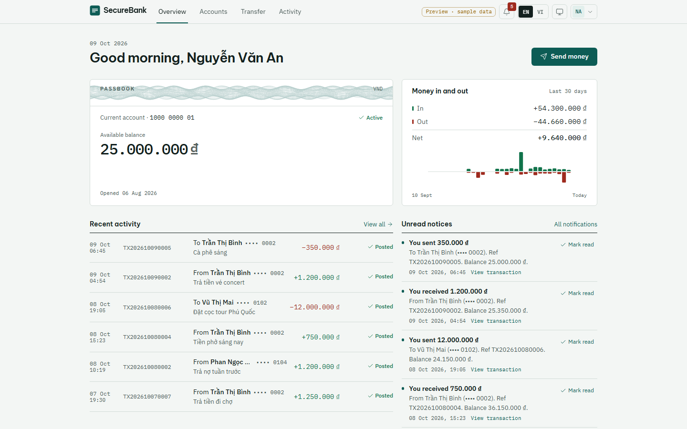
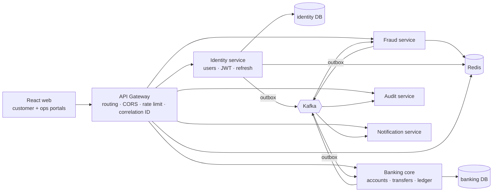
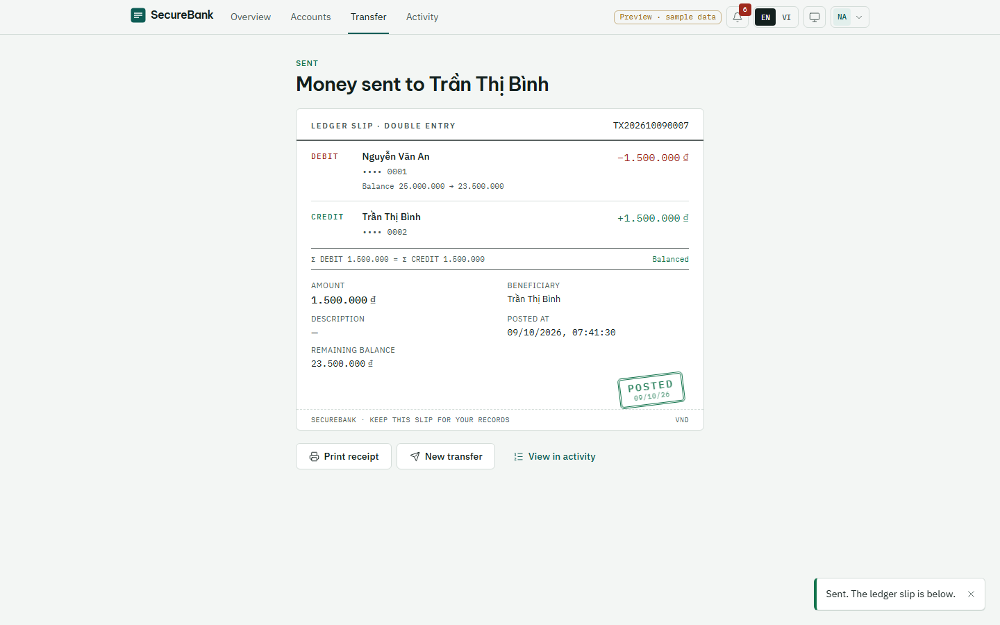
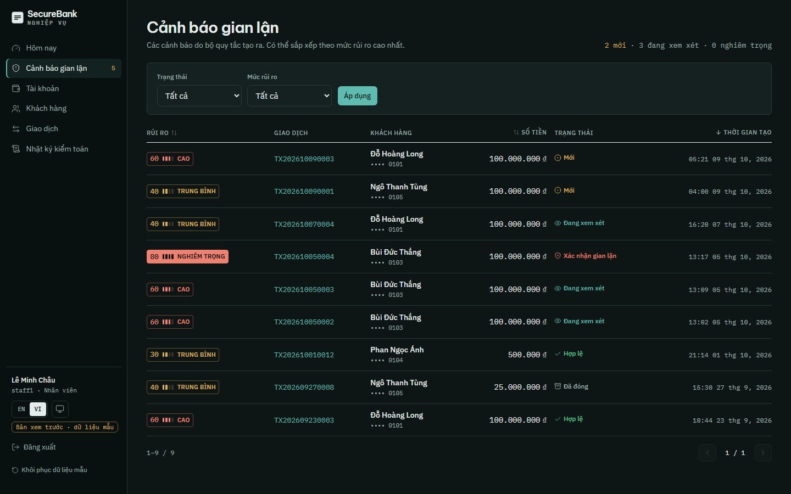
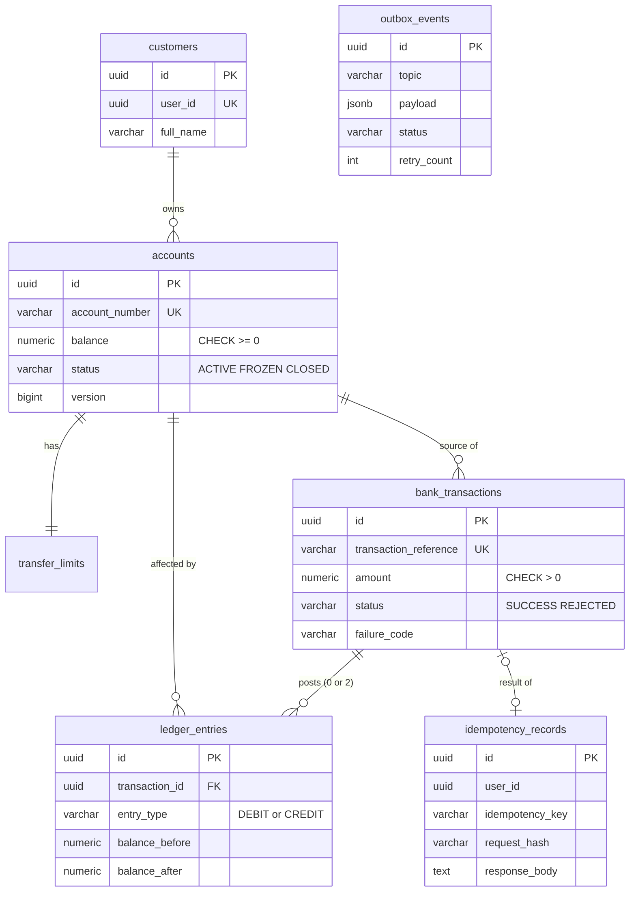
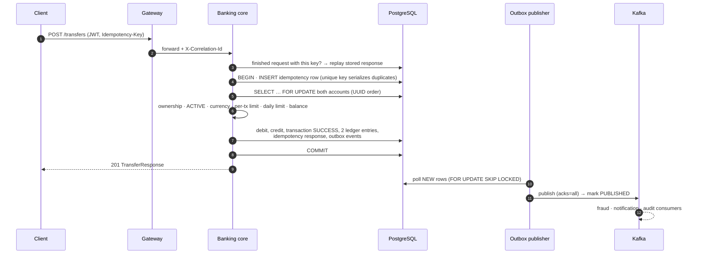
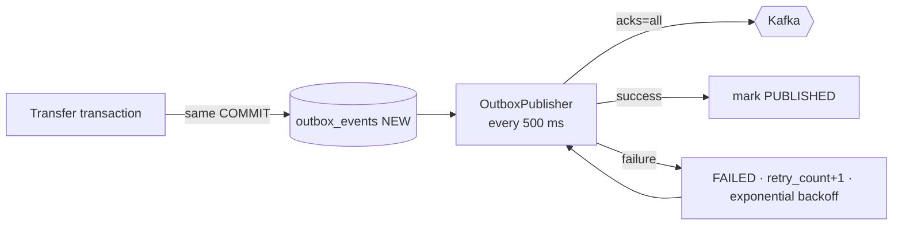
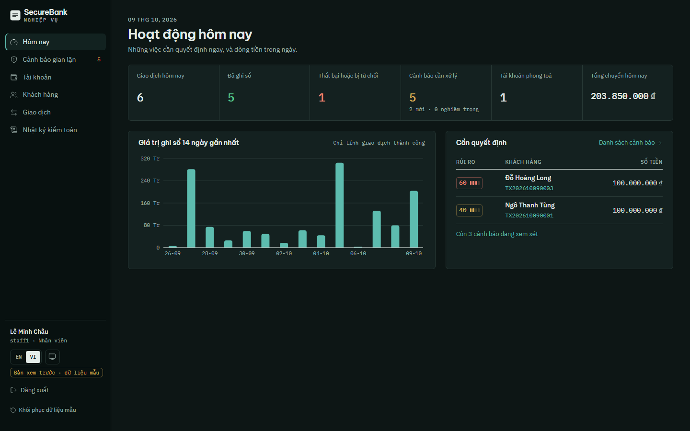

# SecureBank — Digital Banking Transaction & Fraud Monitoring Platform

[](https://github.com/tonynguyenbk/securebank/actions/workflows/ci.yml)
[](https://github.com/tonynguyenbk/securebank/actions/workflows/deploy-preview.yml)

**Live UI preview:** https://tonynguyenbk.github.io/securebank/ — the frontend running against an in-browser mock of the real API
(labelled *Preview · sample data*). The full stack with the real backend runs locally with one `docker compose up --build`.



---

## 1. Project overview

SecureBank is a production-inspired banking platform built to show how a backend engineer reasons about **moving money correctly**:
ACID transfers, pessimistic row locking, idempotent requests, an append-only double-entry ledger, a transactional outbox feeding
Kafka, rule-based fraud detection, role-based access control and a complete audit trail — with a bilingual (EN/VI) customer portal
and a bank-operations portal on top.

Every claim below is backed by an automated test, and CI runs the full demo scenario against the real Docker stack on every push.

## 2. The real-world problem

A retail bank's internal transfer looks trivial — subtract here, add there — until you add reality:

- two transfers spend the same balance at the same millisecond;
- the mobile app times out and retries a payment the server already executed;
- the message broker is down right after the database committed;
- an auditor asks *who froze this account, when, and what did it look like before?*;
- a customer guesses another customer's account ID in the URL.

SecureBank implements each of these situations deliberately and proves the outcome with tests.

## 3. Key banking engineering challenges

| Question an interviewer will ask | Where it is answered |
|---|---|
| What happens if two transfers spend the same balance at the same time? | [§11 Concurrency](#11-concurrency-handling) · `TransferConcurrencyIntegrationTest` |
| What happens if the client retries a payment? | [§10 Idempotency](#10-idempotency) · `TransferIntegrationTest` |
| What happens if Kafka is unavailable after a DB commit? | [§13 Transactional outbox](#13-transactional-outbox) |
| How do you preserve an audit trail? | [§15 Security model](#15-security-model) · append-only DB triggers |
| How do you prevent customers from accessing other accounts? | Ownership derived from the JWT, never from the request · `AuthorizationIntegrationTest` |
| How do you reconcile ledger entries? | [§12 Double-entry ledger](#12-double-entry-ledger) · `GET /admin/reconciliation/transactions/{id}` |
| Why is money stored as `BigDecimal`? | Binary floating point cannot represent 0.1 exactly; `BigDecimal` + `NUMERIC(19,2)` keeps every đồng exact |
| Why keep money movement in one bounded service? | [§4 Architecture](#4-architecture) |

## 4. Architecture



**Core principle:** everything that must be atomically consistent for a transfer — debit, credit, transaction row, two ledger
entries, idempotency record, outbox event — lives in **one service and one PostgreSQL transaction**. The system is split into
microservices where boundaries are natural (identity, fraud, audit, notifications), but money movement never needs a distributed
transaction. Everything downstream reacts to events asynchronously and idempotently.

Details: [`docs/architecture.md`](docs/architecture.md).

## 5. Technology stack

| Layer | Technology |
|---|---|
| Backend | Java 21, Spring Boot 3.5, Spring Web / Data JPA / Security / Validation / Kafka / Data Redis / Actuator, Spring Cloud Gateway, Flyway, jjwt, springdoc-openapi |
| Data | PostgreSQL 17 (one container, five databases), Redis 7.4, Kafka 3.9 (KRaft) |
| Testing | JUnit 5, Mockito, Spring Boot Test, Testcontainers (PostgreSQL, Kafka, Redis), MockWebServer |
| Frontend | React 19, TypeScript, Vite, Tailwind CSS v4, React Router, TanStack Query, Axios, Recharts, i18next, MSW |
| Ops | Docker, Docker Compose, Prometheus, Grafana, GitHub Actions (CI, E2E, Pages deploy) |

## 6. Main features

**Customers** — sign in / register · accounts and passbook statement · beneficiary name check before sending · transfer with review
step and a **double-entry receipt** · activity with filters and pagination · in-app notifications · EN/VI · light/dark.

**Bank staff** — operations dashboard (today's volume, rejections, open fraud alerts, frozen accounts, 14-day chart) · fraud queue
and alert review (triggered rules, score, timeline) · freeze/unfreeze with mandatory reason · transfer-limit editor · customer and
transaction search with full ledger view.

**Auditors** — read-only access to transactions, ledger, reconciliation and the audit log (who / what / when / before / after /
correlation ID). No mutation controls are rendered, and every mutation endpoint returns 403 for them.

| | |
|---|---|
|  |  |
| Double-entry receipt after a transfer | Fraud queue (Vietnamese, dark mode) |

## 7. Project structure

```text
securebank/
├── backend/                     Maven multi-module (Spring Boot 3.5, Java 21)
│   ├── common/                  shared: ApiError/ErrorCode, correlation IDs, JWT validation,
│   │                            transactional outbox, consumer idempotency, event records
│   ├── api-gateway/             Spring Cloud Gateway (reactive)
│   ├── identity-service/        users, roles, JWT, refresh-token rotation, login rate limit
│   ├── banking-core-service/    customers, accounts, transfers, ledger, limits, admin API
│   ├── fraud-service/           rule engine, Redis signals, alert review
│   ├── audit-service/           append-only audit log + search
│   ├── notification-service/    simulated email/SMS/in-app notifications
│   └── Dockerfile               one multi-stage image definition for every module
├── frontend/                    React + TypeScript + Vite + Tailwind
├── infra/                       postgres init, prometheus, grafana, frontend nginx
├── scripts/                     smoke-test.sh (spec demo), seed-demo-data.sh, reset-local-env.sh
├── docs/                        architecture, API flows, database design, security, contracts, design system
└── docker-compose.yml
```

## 8. Database design

Each service owns its database and its Flyway migrations (`ddl-auto=validate` — Hibernate never creates schema).
Banking core, the heart of the system:



The database itself enforces the invariants, so a bug in Java cannot corrupt the books:
`CHECK (balance >= 0)`, `CHECK (amount > 0)`, one DEBIT and one CREDIT per transaction (`UNIQUE (transaction_id, entry_type)`),
balance arithmetic (`balance_after = balance_before ∓ amount`), and triggers that reject `UPDATE`, `DELETE` and `TRUNCATE` on
`ledger_entries` and `audit_logs`. Money is `NUMERIC(19,2)` ↔ `BigDecimal`; timestamps are `TIMESTAMPTZ`.

Full schemas for all services: [`docs/database-design.md`](docs/database-design.md).

## 9. Transfer lifecycle



If any step fails, the whole transaction rolls back — no partial transfer exists. A business rejection (e.g. insufficient funds)
rolls back too, and is then recorded in a **second** transaction as a `REJECTED` transaction with no ledger lines, plus a
`TransactionFailedEvent`, so operations can see it. Code: `application/transfer/TransferExecutor.java`.
More flows: [`docs/api-flows.md`](docs/api-flows.md).

## 10. Idempotency

Every `POST /transfers` requires an `Idempotency-Key` (the frontend generates a UUID per intentional submission and **reuses it
when retrying after a timeout or network error**).

| Situation | Result |
|---|---|
| Same key, same payload, first request finished | Stored status + body returned byte-for-byte, header `Idempotent-Replayed: true`, no money moves |
| Same key, **different** payload | `409 IDEMPOTENCY_KEY_CONFLICT` (SHA-256 of the canonical request differs) |
| Same key, two requests **concurrently** | The idempotency row is the first insert of the transaction; the unique index makes the second request wait, then replay the winner's result |
| Same key after a business rejection | The stored `422` is replayed — one key, one outcome |

Tested with six simultaneous requests carrying the same key: exactly one transfer. Code: `IdempotencyService.java`.

## 11. Concurrency handling

- Both accounts are locked with `SELECT … FOR UPDATE` (JPA `PESSIMISTIC_WRITE`) **in a fixed order** — by UUID, compared the way
  PostgreSQL orders them — so two opposite transfers A→B and B→A cannot deadlock.
- The balance and the **daily limit** are checked while holding the source lock, so they can't be bypassed by parallel requests.
- A 5-second `lock_timeout` returns `409 ACCOUNT_BUSY` (safe to retry with the same key) instead of hanging.

Spec scenario, automated in `TransferConcurrencyIntegrationTest`: balance 1,000,000 · two simultaneous 800,000 transfers →
**exactly one SUCCESS, final balance 200,000, no negative balance, ledger consistent.** Ten opposite-direction transfers between two
accounts run without deadlock and conserve the total.

## 12. Double-entry ledger

Every successful transfer writes exactly two immutable entries:

```text
DEBIT   1000000001   −1,000,000   25,000,000 → 24,000,000
CREDIT  1000000002   +1,000,000   10,000,000 → 11,000,000
```

The ledger is append-only (no update/delete code paths, plus DB triggers). The customer receipt shows these two lines, and
`GET /admin/reconciliation/transactions/{id}` (auditor/admin) verifies that debits equal credits, that the debit is on the source and
the credit on the destination, that both equal the transaction amount, and that the running balances are consistent.

## 13. Transactional outbox

Publishing to Kafka inside the money transaction would be wrong both ways: a commit followed by a failed publish loses the event; a
publish followed by a rollback announces a transfer that never happened. Instead:



- **Kafka down after the commit?** The transfer already succeeded; the event waits in `outbox_events` and is published when Kafka
  returns. Nothing is lost and the API is unaffected.
- Delivery is **at-least-once**, so every consumer is idempotent: it records `(eventId, consumer)` in `processed_events` inside its
  own transaction before doing any work.
- `FOR UPDATE SKIP LOCKED` lets several instances poll the same table safely.
- Metrics: `outbox_pending_count`, `kafka_publish_failure_total`.

The outbox and consumer-idempotency code lives once in `backend/common` and is used by identity, banking core and fraud.

## 14. Kafka event flow

| Topic | Producer | Consumers |
|---|---|---|
| `bank.transaction.completed.v1` | banking core | fraud, notification |
| `bank.transaction.failed.v1` | banking core | notification |
| `bank.account.status.changed.v1` | banking core | notification |
| `bank.user.registered.v1` | identity | banking core (opens an account), notification |
| `bank.fraud.alert.created.v1` | fraud | — (available to downstream systems) |
| `bank.audit.event.v1` | identity, banking core, fraud | audit |

Events are versioned, keyed by aggregate, carry the HTTP request's correlation ID in a header, and are defined once as Java records
in `common` — producers and consumers cannot drift apart. Contract: [`docs/contracts/events.md`](docs/contracts/events.md).

## 15. Security model

- **Authentication:** BCrypt (strength 12) passwords; 15-minute HS256 access JWTs (`sub`, `username`, `roles`, `jti`); opaque refresh
  tokens stored only as SHA-256 hashes and **rotated** on every use — reusing an old one revokes all of that user's sessions.
  Logout denylists the access token's `jti` in Redis.
- **Authorization:** four roles (CUSTOMER, BANK_STAFF, AUDITOR, ADMIN) enforced with `@PreAuthorize` in every service. Ownership is
  derived from the token's user ID, never from request data; another customer's transaction returns 404, not 403, so existence
  isn't leaked.
- **Abuse limits:** login lockout after 5 failures per username/IP (Redis); gateway rate limiting on login and transfers.
- **Auditability:** logins, registrations, transfers, rejections, freezes, limit changes and fraud reviews produce audit events
  with actor, IP, correlation ID and before/after state; the audit table rejects updates and deletes at the database level.
- **Hygiene:** secrets only from environment variables (`.env` is git-ignored), no stack traces in responses, account numbers masked
  in logs, no tokens or passwords logged, secure headers, CORS only at the gateway.

Details and trade-offs (e.g. refresh token in `sessionStorage` vs HttpOnly cookie): [`docs/security.md`](docs/security.md).

## 16. Fraud detection

Rule-based, evaluated asynchronously on every completed transfer:

| Rule | Condition | Score |
|---|---|---|
| `HIGH_AMOUNT` | amount ≥ 100,000,000 VND | +40 |
| `HIGH_FREQUENCY` | > 5 outgoing transfers in 60 s (Redis sorted-set window) | +30 |
| `DAILY_VELOCITY` | today's outgoing total > 200,000,000 VND | +20 |
| `NEW_BENEFICIARY` | first transfer to this account and amount ≥ 10,000,000 | +20 |

Score → LOW (0–29), MEDIUM (30–59), HIGH (60–79), CRITICAL (80+). MEDIUM and above create an alert for staff review
(`OPEN → UNDER_REVIEW → APPROVED | REJECTED → CLOSED`). The rule engine is a pure class with no Spring or Redis dependency, so every
rule and boundary is unit-tested. Customers are never notified about fraud alerts (no tipping-off).

## 17. Docker setup

```bash
cp .env.example .env          # then set JWT_SECRET (openssl rand -base64 48) and DB_PASSWORD
docker compose up --build
```

| URL | What |
|---|---|
| http://localhost:3000 | Web app (nginx, proxies `/api` to the gateway) |
| http://localhost:8080 | API gateway |
| http://localhost:9090 | Prometheus |
| http://localhost:3001 | Grafana — dashboard *SecureBank — Overview* |

Twelve containers start with health checks and ordered startup (`depends_on: service_healthy`); Kafka topics are created explicitly
by a one-shot `kafka-init` container. PostgreSQL is exposed on host port **5433** to avoid clashing with a local installation.

Then run the spec's end-to-end demo against it:

```bash
./scripts/smoke-test.sh       # 27 checks: transfer, replay, limits, fraud, freeze, audit, notifications
```

## 18. Local VSCode development

```bash
docker compose up -d postgres redis kafka          # infrastructure only
cd backend && ./mvnw -pl banking-core-service -am spring-boot:run   # any service; reads ../.env automatically
cd frontend && npm install && npm run dev          # http://localhost:3000, proxies /api → :8080
```

Frontend without any backend: `VITE_API_MODE=mock npm run dev` (the same mock API that powers the live preview).

## 19. Demo accounts

Seeded only when `SECUREBANK_DEMO_SEED=true` (local demo; never in production config).

| Username | Password | Role | Account |
|---|---|---|---|
| customer1 | Customer@123 | Customer — Nguyễn Văn An | 1000000001 · 25,000,000 VND |
| customer2 | Customer@123 | Customer — Trần Thị Bình | 1000000002 · 10,000,000 VND |
| staff1 | Staff@123 | Bank staff | — |
| auditor1 | Auditor@123 | Auditor | — |
| admin1 | Admin@123 | Admin | — |

## 20. API documentation

- Contract: [`docs/contracts/api.md`](docs/contracts/api.md) — every endpoint, role, DTO and error code.
- Swagger UI per service: `http://localhost:808{1..5}/swagger-ui.html` when running services locally.
- Postman: [`docs/api/SecureBank.postman_collection.json`](docs/api/SecureBank.postman_collection.json) +
  [`SecureBank.local.postman_environment.json`](docs/api/SecureBank.local.postman_environment.json) — logs in, stores the token,
  generates a fresh `Idempotency-Key` per transfer.

Errors always have one shape:

```json
{ "timestamp": "2026-10-08T10:42:00Z", "status": 409, "code": "IDEMPOTENCY_KEY_CONFLICT",
  "message": "The idempotency key was already used with a different request.",
  "path": "/api/v1/transfers", "correlationId": "…" }
```

## 21. Testing

| Suite | Count | What it proves |
|---|---|---|
| Backend unit + integration (Testcontainers: real PostgreSQL, Kafka, Redis) | 212 | transfer success, insufficient funds, frozen source/destination, per-tx and daily limits, idempotent replay, key conflict, **concurrent spend**, **concurrent same key**, rollback after debit (fault injection), ownership, role permissions, ledger immutability, reconciliation, outbox → Kafka, consumer idempotency, fraud rules, audit append-only, notifications, JWT, refresh rotation, rate limits |
| End-to-end (`scripts/smoke-test.sh`, CI job `e2e`) | 27 checks | the spec's §51 demo against the real Docker Compose stack |
| Frontend | — | type-checked build + lint in CI; visual QA by Playwright screenshots (no automated UI tests yet) |

```bash
cd backend && ./mvnw verify       # needs Docker for Testcontainers
```

## 22. Screenshots

| | |
|---|---|
|  |  |
|  |  |

Design rationale (palette, typography, the double-entry receipt as the signature element):
[`docs/design/DESIGN_SYSTEM.md`](docs/design/DESIGN_SYSTEM.md).

## 23. Future improvements

Known limitations of this version, stated plainly:

- Kafka poison messages are logged and skipped after retries rather than sent to a dead-letter topic.
- The per-day transaction-reference counter serializes commits system-wide; a sequence-based reference would scale further.
- Fraud Redis counters are not rolled back with the consumer's DB transaction (bias: more scrutiny, never less).
- No automated frontend tests yet; the refresh token lives in `sessionStorage` (an HttpOnly cookie via the gateway is the
  production choice).
- JWTs are HS256 with a shared secret; RS256 with a JWKS endpoint would let services verify without holding a signing key.

Beyond that: OAuth2 authorization server, MFA/WebAuthn, real notification providers, CDC with Debezium instead of polling, sagas for
external/interbank payments, Kubernetes, centralized logs (ELK/OpenSearch), OpenTelemetry tracing, a secrets manager / HSM, PCI-DSS
style controls, ML anomaly detection, multi-currency accounts, scheduled payments and saved beneficiaries.

---

Build history and decisions: [`docs/IMPLEMENTATION_STATUS.md`](docs/IMPLEMENTATION_STATUS.md).
