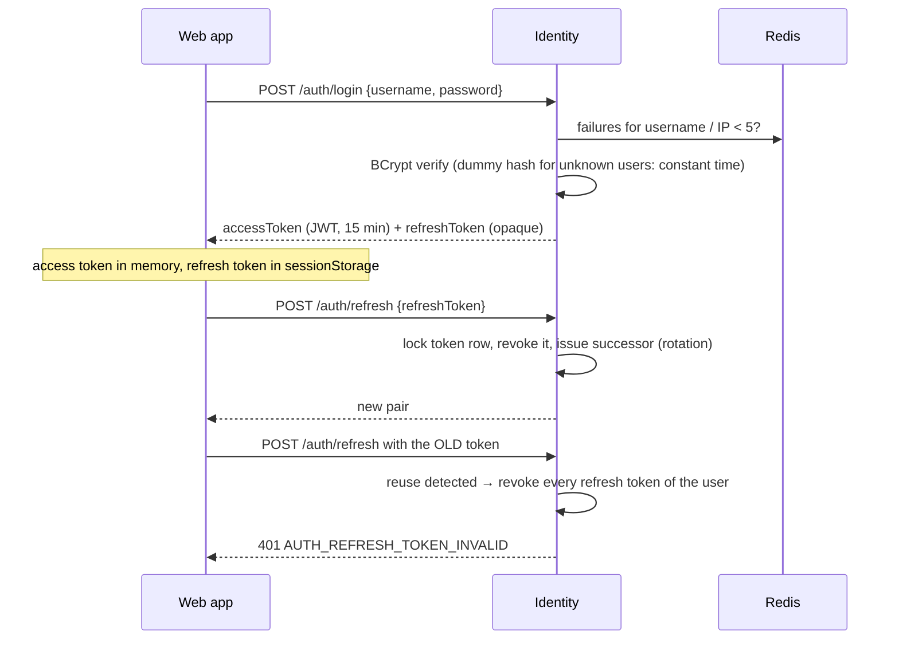
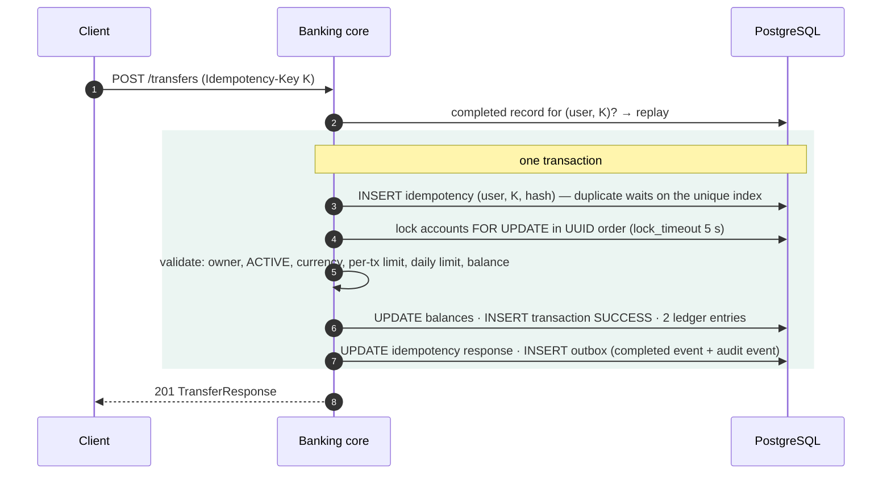
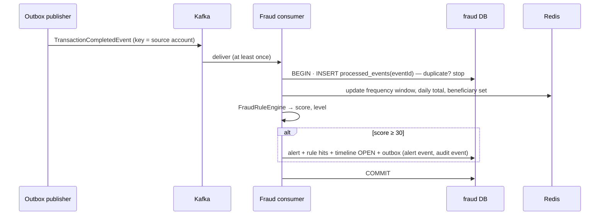

# API flows

The REST contract (every path, role, DTO and error code) is [`contracts/api.md`](contracts/api.md); this document explains the
flows that matter most.

## 1. Sign-in and token refresh

On logout the refresh token is revoked and the access token's `jti` is written to Redis (`auth:denylist:<jti>`) until it would have
expired; services with Redis reject it immediately.

## 2. Transfer

Rejection path (insufficient funds, limit, frozen…): the transaction above rolls back; a second transaction stores a `REJECTED`
transaction without ledger entries, the 422 response under the same key, a `TransactionFailedEvent` and a `TRANSFER_REJECTED`
audit event. Validation errors that happen before the source account is identified (bad format, missing key) are not persisted.

| Code | When |
|---|---|
| 400 `IDEMPOTENCY_KEY_REQUIRED` / `VALIDATION_FAILED` / `SAME_ACCOUNT_TRANSFER` / `CURRENCY_NOT_SUPPORTED` | request shape |
| 403 `ACCOUNT_NOT_OWNED`, 404 `ACCOUNT_NOT_FOUND` | ownership / existence |
| 409 `IDEMPOTENCY_KEY_CONFLICT`, `IDEMPOTENCY_REQUEST_IN_PROGRESS`, `ACCOUNT_BUSY` | concurrency |
| 422 `ACCOUNT_FROZEN`, `ACCOUNT_CLOSED`, `TRANSFER_LIMIT_EXCEEDED`, `DAILY_LIMIT_EXCEEDED`, `INSUFFICIENT_FUNDS` | business rules (persisted as REJECTED) |

## 3. Retry semantics seen from the client

The web app creates one `Idempotency-Key` per intentional submission and:

- **keeps it** when the request failed in transit (network error, timeout, 5xx, `IDEMPOTENCY_REQUEST_IN_PROGRESS`, `ACCOUNT_BUSY`) —
  "Retry safely" can never send money twice;
- **replaces it** after a success, after a definitive 4xx, or as soon as the user edits any field.

## 4. Event processing (fraud example)

Poison messages are retried four times with backoff and then skipped (logged with topic/partition/offset, counted in
`kafka_consumer_skipped_total`) so one bad record can't block a partition.

## 5. Freeze an account

`PATCH /admin/accounts/{id}/freeze {reason}` (BANK_STAFF, ADMIN) → status change, `AccountStatusChangedEvent` and an `ACCOUNT_FREEZE`
audit event with `before: {status: ACTIVE}` / `after: {status: FROZEN, reason}` in one transaction. The notification service tells
the customer the account is frozen without repeating the reason. A frozen account cannot send but can still receive.

## 6. Reconciliation

`GET /admin/reconciliation/transactions/{id}` (AUDITOR, ADMIN) recomputes from the ledger: number of entries, Σ debits, Σ credits,
debit on the source / credit on the destination, both equal to the transaction amount, running balances consistent →
`balanced: true|false`.

## 7. End-to-end demo

`scripts/smoke-test.sh` walks the whole spec scenario through the gateway — sign in, transfer, replay, conflicting replay, limit
rejection, fraud alert from a burst of transfers, freeze, blocked transfer, auditor reconciliation and audit log, auditor blocked
from mutating, cross-customer access blocked, recipient notification, cleanup. CI runs it against the real stack on every push.
