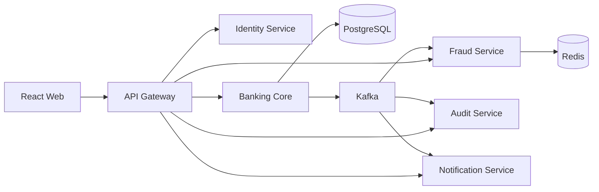

# Architecture

## System view

| Service | Port | Owns | Talks to |
|---|---|---|---|
| api-gateway | 8080 | routing table, CORS, correlation IDs, rate limits | every service over HTTP, Redis (limiter) |
| identity-service | 8081 | `identity` DB: users, roles, refresh tokens | Redis (login limiter, logout denylist), Kafka via outbox |
| banking-core-service | 8082 | `banking` DB: customers, accounts, transactions, ledger, limits, idempotency | Redis (denylist check), Kafka via outbox, consumes `user.registered` |
| fraud-service | 8083 | `fraud` DB: alerts, rule hits, timeline, known beneficiaries | Redis (velocity signals), Kafka in + out |
| audit-service | 8084 | `audit` DB: append-only audit log | Kafka in |
| notification-service | 8085 | `notification` DB: notifications | Kafka in |

Every service is a Spring Boot 3.5 / Java 21 application with its own Flyway migrations, Actuator health/metrics, Prometheus
endpoint and OpenAPI document. Services never read each other's databases.

## Why money movement lives in one service

A transfer must debit, credit, record the transaction, write two ledger entries, store the idempotency result and enqueue its event
**atomically**. Spreading those writes across services would need a distributed transaction (2PC) or a saga with compensations —
both add failure modes that a bank cannot accept for an internal transfer. So everything that must be consistent is inside
banking-core and one PostgreSQL transaction; everything that can be eventually consistent (fraud scoring, notifications, the audit
trail) reacts to events.

This keeps the strongest guarantee where it matters and still shows microservice boundaries, independent deployment and
event-driven integration.

## The shared `common` module

Cross-cutting behaviour is written once and auto-configured into every servlet service:

| Package | Provides |
|---|---|
| `error` | `ErrorCode` (stable public codes), `ApiError` body, `GlobalExceptionHandler` — no stack traces leave a service |
| `web` | `CorrelationIdFilter` (MDC + response header), `PageResponse`, account-number masking |
| `security` | `JwtTokenValidator`, `JwtAuthenticationFilter`, Redis revocation check, `SecureBankHttpSecurity` baseline (stateless, secure headers, JSON 401/403) |
| `outbox` | `OutboxWriter` (insert in the business transaction), `OutboxPublisher` (poll → Kafka → mark published, retries, metrics) |
| `kafka` | `ProcessedEventStore` (consumer idempotency), correlation-ID record interceptor |
| `events` | Java records for every event + `Topics` — the schema both producer and consumer compile against |
| `db/common` | Flyway migrations for `outbox_events` and `processed_events`, opted into per service |

The reactive gateway does not use `common` (it is servlet-based); it re-implements the correlation ID and error body for WebFlux.

## Request path

1. Browser → nginx (`/api`) or Vite dev proxy → gateway `:8080`.
2. Gateway validates/creates `X-Correlation-Id`, applies CORS and rate limits, routes by path prefix.
3. The service's `CorrelationIdFilter` puts the ID in MDC; `JwtAuthenticationFilter` verifies the token (signature, issuer, expiry,
   type, revocation) and builds an `AuthenticatedUser`.
4. Controller → application service (business rules, `@Transactional`) → repositories.
5. State change + outbox row commit together; the response returns immediately.
6. `OutboxPublisher` ships the event to Kafka with the correlation ID header; consumers restore it into their MDC, so one ID follows
   the request across every log line in every service.

## Deployment view

`docker-compose.yml` starts PostgreSQL (five databases from one init script), Redis, Kafka (KRaft) plus a topic-init container,
the six services built from one multi-stage `backend/Dockerfile` (module chosen by build arg, non-root JRE runtime), the frontend
(nginx), Prometheus and Grafana. Health checks and `depends_on: service_healthy` give a deterministic startup order.

CI (`.github/workflows/ci.yml`) runs the backend tests with Testcontainers, the frontend build, and an **end-to-end job that starts
the whole compose stack and runs `scripts/smoke-test.sh`**. The frontend preview is deployed to GitHub Pages in mock mode.

## Observability

- `/actuator/health` (liveness/readiness), `/actuator/prometheus` on every service.
- Business metrics: `transfer_success_total`, `transfer_failure_total{code}`, `transfer_latency`, `transfer_idempotent_replay_total`,
  `outbox_pending_count`, `kafka_publish_failure_total`, `fraud_alert_total{riskLevel}`, `kafka_consumer_skipped_total`.
- Grafana dashboard *SecureBank — Overview* is provisioned from `infra/grafana/dashboards`.
- In Docker, logs are structured (ECS JSON) and every line carries `correlationId`.
