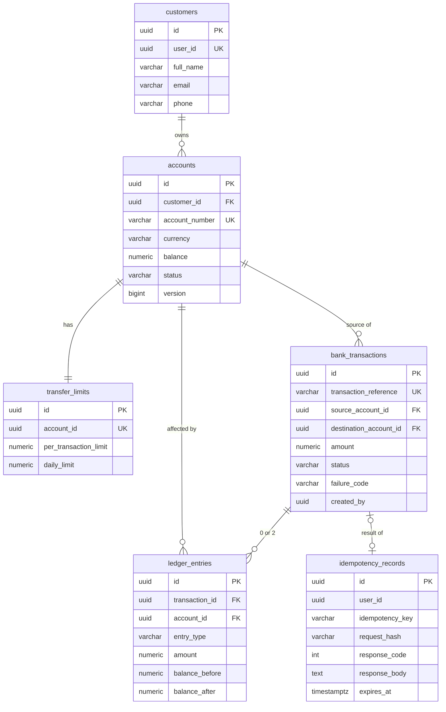

# Database design

One PostgreSQL 17 container hosts five databases — `identity`, `banking`, `fraud`, `audit`, `notification` — one per service.
Each service owns its schema through Flyway (`src/main/resources/db/migration`) and runs Hibernate with `ddl-auto=validate`.
Producing/consuming services also apply the shared `db/common` migrations (`outbox_events`, `processed_events`).

Conventions: UUID primary keys · money `NUMERIC(19,2)` (Java `BigDecimal`) · timestamps `TIMESTAMPTZ` (stored UTC; "today" for
limits and stats is the Asia/Ho_Chi_Minh business day) · invariants enforced with constraints and triggers, not only in Java.

## banking

| Table | Key constraints |
|---|---|
| `accounts` | `UNIQUE(account_number)`, `CHECK (balance >= 0)`, status ∈ ACTIVE/FROZEN/CLOSED; new numbers from `account_number_seq` (starts 1000000101) |
| `bank_transactions` | `UNIQUE(transaction_reference)`, `CHECK (amount > 0)`, source ≠ destination, SUCCESS ⇒ no failure code and `completed_at` set |
| `ledger_entries` | `UNIQUE(transaction_id, entry_type)` (one DEBIT + one CREDIT), `CHECK (amount > 0)`, `balance_after = balance_before ∓ amount`; triggers reject UPDATE / DELETE / TRUNCATE |
| `idempotency_records` | `UNIQUE(user_id, idempotency_key)` — the row that serializes duplicate requests; expires after 24 h |
| `transaction_reference_counters` | one row per business day, upserted to produce `TX` + `yyyyMMdd` + 4-digit counter |
| `transfer_limits` | defaults 100,000,000 per transaction / 500,000,000 per day |

Indexes cover `account_number`, `transaction_reference`, `customer_id`, `created_at`, transaction status, outbox status — see
`V8__add_indexes.sql`.

## identity

| Table | Columns / notes |
|---|---|
| `users` | id, username (unique), password_hash (BCrypt), full_name, email, phone, enabled, version |
| `roles`, `user_roles` | CUSTOMER, BANK_STAFF, AUDITOR, ADMIN |
| `refresh_tokens` | token_hash (SHA-256, unique), expires_at, revoked_at, replaced_by_id (rotation chain), created_ip, user_agent |

## fraud

| Table | Columns / notes |
|---|---|
| `fraud_alerts` | transaction_id (unique), customer and account snapshot from the event, amount, risk_score, risk_level, status, reviewer fields, version (optimistic lock) |
| `fraud_rule_hits` | alert_id, rule_code, score_contribution, details |
| `fraud_alert_status_history` | timeline: status, actor, note, changed_at |
| `known_beneficiaries` | (customer_id, destination_account_id) — source of truth behind the Redis set for `NEW_BENEFICIARY` |

## audit

`audit_logs`: event_id (unique — consumer idempotency), occurred_at, received_at, actor (id, username, role), action,
resource_type/resource_id, `before`/`after` JSONB, outcome, correlation_id, ip_address, source_service. Triggers reject UPDATE,
DELETE and TRUNCATE: the trail is append-only at the database level. Indexed by time, actor, action, resource and correlation ID.

## notification

`notifications`: recipient_user_id, channel (EMAIL/SMS/IN_APP), template_code, params JSONB, English subject/message, status,
read_at, related_transaction_id, source_event_id; `UNIQUE(source_event_id, recipient_user_id, channel, template_code)` prevents
duplicates on redelivery.

## Shared (`db/common`)

| Table | Purpose |
|---|---|
| `outbox_events` | id (= eventId), aggregate, event_type, topic, key, payload JSONB, correlation_id, status NEW/PUBLISHED/FAILED, retry_count, last_error, next_attempt_at |
| `processed_events` | (event_id, consumer) primary key — a redelivered event is detected inside the consumer's transaction |
